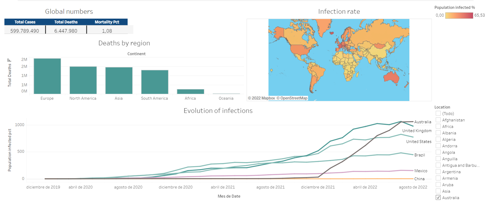

<h3 align="Center">
    
     
</h3>

# COVID-deaths
This repository contains the queries used to generate a Tableau visualization on the COVID state in different countries. 

See full COVID dashborard [here](https://public.tableau.com/app/profile/kevin.figueroa)
